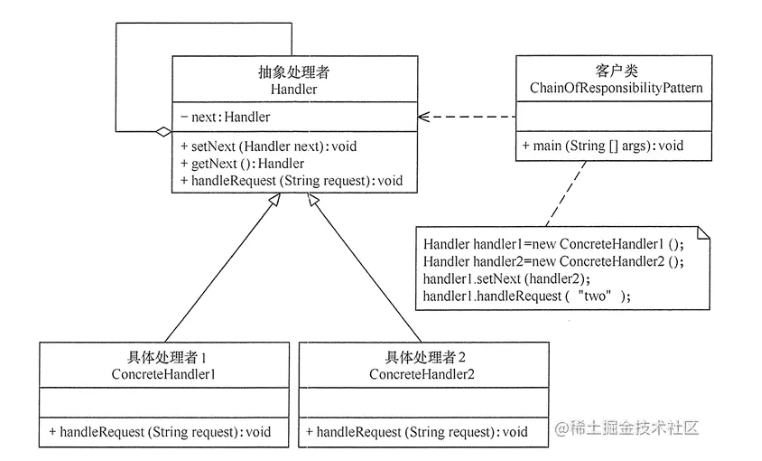

## 1 策略模式是什么
> 抽象处理者（Handler）角色： 定义一个处理请求的接口，包含抽象处理方法和一个后继连接。
> 
> 具体处理者（Concrete Handler）角色： 实现抽象处理者的处理方法，判断能否处理本次请求，如果可以处理请求则处理，否则将该请求转给它的后继者。
> 
> 客户类（Client）角色： 创建处理链，并向链头的具体处理者对象提交请求，它不关心处理细节和请求的传递过程。





```java
public enum GatewayEnum {
    // handlerId, 拦截者名称，全限定类名，preHandlerId，nextHandlerId  
    API_HANDLER(new GatewayEntity(1, "api接口限流", "cn.dgut.design.chain_of_responsibility.GateWay.impl.ApiLimitGatewayHandler", null, 2)),
    BLACKLIST_HANDLER(new GatewayEntity(2, "黑名单拦截", "cn.dgut.design.chain_of_responsibility.GateWay.impl.BlacklistGatewayHandler", 1, 3)),
    SESSION_HANDLER(new GatewayEntity(3, "用户会话拦截", "cn.dgut.design.chain_of_responsibility.GateWay.impl.SessionGatewayHandler", 2, null)),
    ;

    GatewayEntity gatewayEntity;

    public GatewayEntity getGatewayEntity() {
        return gatewayEntity;
    }

    GatewayEnum(GatewayEntity gatewayEntity) {
        this.gatewayEntity = gatewayEntity;
    }
}

public class GatewayEntity {

    private String name;

    private String conference;

    private Integer handlerId;

    private Integer preHandlerId;

    private Integer nextHandlerId;
}

public abstract class GatewayHandler {

    protected GatewayHandler next;

    public void setNext(GatewayHandler next) {
        this.next = next;
    }

    public abstract void service();
}


public interface GatewayDao {

    /**
     * 根据 handlerId 获取配置项  
     * @param handlerId
     * @return
     */
    GatewayEntity getGatewayEntity(Integer handlerId);

    /**
     * 获取第一个处理者  
     * @return
     */
    GatewayEntity getFirstGatewayEntity();
}

public class GatewayImpl implements GatewayDao {

    /**
     * 初始化，将枚举中配置的handler初始化到map中，方便获取  
     */
    private static Map<Integer, GatewayEntity> gatewayEntityMap = new HashMap<>();

    static {
        GatewayEnum[] values = GatewayEnum.values();
        for (GatewayEnum value : values) {
            GatewayEntity gatewayEntity = value.getGatewayEntity();
            gatewayEntityMap.put(gatewayEntity.getHandlerId(), gatewayEntity);
        }
    }

    @Override
    public GatewayEntity getGatewayEntity(Integer handlerId) {
        return gatewayEntityMap.get(handlerId);
    }

    @Override
    public GatewayEntity getFirstGatewayEntity() {
        for (Map.Entry<Integer, GatewayEntity> entry : gatewayEntityMap.entrySet()) {
            GatewayEntity value = entry.getValue();
            //  没有上一个handler的就是第一个  
            if (value.getPreHandlerId() == null) {
                return value;
            }
        }
        return null;
    }
}

public class GatewayHandlerEnumFactory {

    private static GatewayDao gatewayDao = new GatewayImpl();

    // 提供静态方法，获取第一个handler  
    public static GatewayHandler getFirstGatewayHandler() {

        GatewayEntity firstGatewayEntity = gatewayDao.getFirstGatewayEntity();
        GatewayHandler firstGatewayHandler = newGatewayHandler(firstGatewayEntity);
        if (firstGatewayHandler == null) {
            return null;
        }

        GatewayEntity tempGatewayEntity = firstGatewayEntity;
        Integer nextHandlerId = null;
        GatewayHandler tempGatewayHandler = firstGatewayHandler;
        // 迭代遍历所有handler，以及将它们链接起来  
        while ((nextHandlerId = tempGatewayEntity.getNextHandlerId()) != null) {
            GatewayEntity gatewayEntity = gatewayDao.getGatewayEntity(nextHandlerId);
            GatewayHandler gatewayHandler = newGatewayHandler(gatewayEntity);
            tempGatewayHandler.setNext(gatewayHandler);
            tempGatewayHandler = gatewayHandler;
            tempGatewayEntity = gatewayEntity;
        }
        // 返回第一个handler  
        return firstGatewayHandler;
    }

    /**
     * 反射实体化具体的处理者  
     * @param firstGatewayEntity
     * @return
     */
    private static GatewayHandler newGatewayHandler(GatewayEntity firstGatewayEntity) {
        // 获取全限定类名  
        String className = firstGatewayEntity.getConference();
        try {
            // 根据全限定类名，加载并初始化该类，即会初始化该类的静态段  
            Class<?> clazz = Class.forName(className);
            return (GatewayHandler) clazz.newInstance();
        } catch (ClassNotFoundException | IllegalAccessException | InstantiationException e) {
            e.printStackTrace();
        }
        return null;
    }


}

public class GetewayClient {
    public static void main(String[] args) {
        GatewayHandler firstGetewayHandler = GatewayHandlerEnumFactory.getFirstGatewayHandler();
        firstGetewayHandler.service();
    }
} 
```